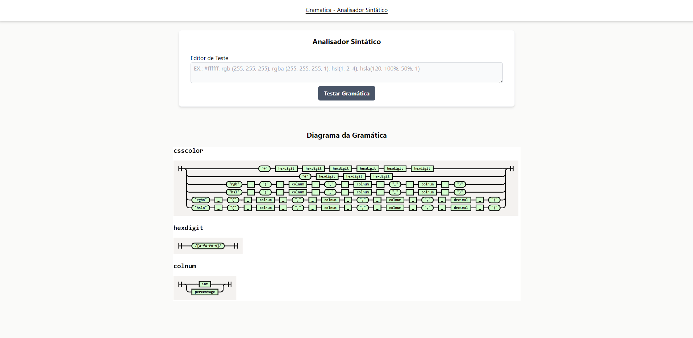

<h4 align="center"> 
	🚀 Code Analysis - v2 🚀
</h4>

<p align="center">
  
  
  
  
  <a href="https://www.linkedin.com/in/paulobeckman/">
    
  </a>
	
  
  <a href="https://github.com/paulobeckman/code-analysis/commits/master">
    
  </a>

  
   <a href="https://github.com/paulobeckman/code-analysis/stargazers">
    
  </a>
</p>

## 💻 Sobre o projeto

Code Analysis é um projeto que visa ter a implementação de conceitos de Copiladores na prática.

### Visualização

##### Visualize a aplicação web aqui: [Code Analysis](https://code-analysis-v2.netlify.app/)

### Códigos Principais

- **Gramatica - Analisador Sintático:** O código responsável por realizar a analisador sintático, encontra-se [aqui](https://github.com/paulobeckman/code-analysis-v2/blob/main/src/pages/Grammar/index.tsx), mais especificamente na linha 17 na função `handleTestClick`. Esse código é executado, quando se insere um valor [no input dessa página](https://code-analysis-v2.netlify.app/) e clica em testar gramática:

    

  A gramática está nesse arquivo [grammar.ne](https://github.com/paulobeckman/code-analysis-v2/blob/main/src/utils/grammar/grammar.ne) e para copilar essa gramatica foi utilizado a biblioteca [nearley](https://nearley.js.org/) e o comando `npx nearleyc grammar.ne -o grammar.js`, com isso gerando o arquivo [grammar.js](https://github.com/paulobeckman/code-analysis-v2/blob/main/src/utils/grammar/grammar.js). Além disso, para gerar o diagrama foi utilizado o comando `npx nearley-railroad grammar.ne -o grammar.html` gerando o arquivo [grammar.html](https://github.com/paulobeckman/code-analysis-v2/blob/main/src/utils/grammar/grammar.html).
  <br/>

## 🛠 Tecnologias

As seguintes ferramentas estão sendo usadas na construção do projeto:

- [Typescript][ts]: É um superconjunto sintático estrito de JavaScript e adiciona tipagem estática opcional à linguagem.
- [ReactJS][react]: Bibioteca para desenvolvimento com javascript/typescript.
- [ViteJS][vitejs]: Deixa os processor de iniciar a aplicação localmente mais rápido.
- [NodeJS][nodejs]: Permite rodar javascript localmente.
- [Tailwindcss][tailwind]: Estilização da aplicação
- [React Router][react-router]: Utilizado por definir as rotas da aplicação

## 🚀 Como rodar este projeto

💡 Esse projeto conta com somente com o Front End.

### Pré-requisitos

Antes de começar, você vai precisar ter instalado em sua máquina as seguintes ferramentas:
[Git](https://git-scm.com), [Node.js][nodejs].
Além disto é bom ter um editor para trabalhar com o código como [VSCode][vscode]

### 🎲 Rodando aplicação web (Front End)

```bash
# Clone o Repositorio
$ git clone https://github.com/paulobeckman/code-analysis-v2.git
```

### 💻 Rode o Project Web

```bash
# Vá para a pasta do projeto
$ cd code-analysis-v2

# Instale as depedencias
$ npm install

# Rode a aplicação
$ npm run dev
```

Acesse: http://localhost:3000/ para ver o resultado.

## 📝 Licença

Este projeto esta sobe a licença MIT. Veja a [LICENÇA](license) para saber mais.

Feito por Paulo Beckman 👋🏽 [Entre em contato!](https://br.linkedin.com/in/paulobeckman)

[nodejs]: https://nodejs.org/
[vscode]: https://code.visualstudio.com/
[license]: https://opensource.org/licenses/MIT
[ts]: https://www.typescriptlang.org/
[react]: https://reactjs.org/
[tailwind]: https://tailwindcss.com/
[react-hook-form]: https://react-hook-form.com/
[react-router]: https://reactrouter.com/en/main
[vitejs]: https://vitejs.dev/
